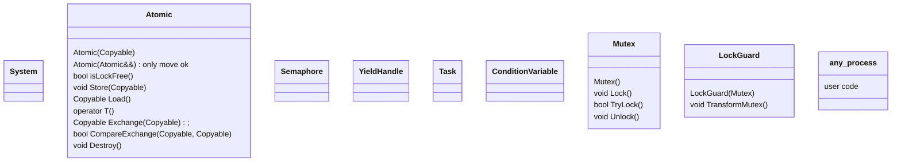

# systemの設計

**title: System Design**

```mermaid
classDiagram

    class System{
        
    }

    class Atomic{
        Atomic(Copyable)
        Atomic(Atomic&&) only move ok
        bool isLockFree()
        void Store(Copyable)
        Copyable Load()
        operator T()
        Copyable Exchange(Copyable);
        bool CompareExchange(Copyable, Copyable)
        void Destroy()

    }

    class Semaphore{

    }

    class YieldHandle{

    }

    class Task{

    }

    class ConditionVariable{

    }

    class Mutex{
        Mutex()
        void Lock()
        bool TryLock()
        void Unlock()
    }

    class LockGuard{
        LockGuard(Mutex)
        void TransformMutex()
    }

    class any_process{
        user code
    }

```