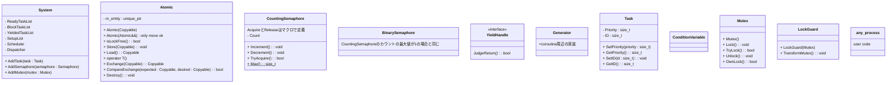

# systemの設計

**title: System Design**

```mermaid
classDiagram

    class System {
        - ReadyTaskList
        - BlockTaskList
        - YieldedTaskList
        - SetupList

        - Scheduler
        - Dispatcher

        + AddTask(task : Task)
        + AddSemaphore(semaphore : Semaphore)
        + AddMutex(mutex : Mutex)
    }

    class Atomic {
        - m_entity : unique_ptr<Copyable> 
        + Atomic(Copyable)
        + Atomic(Atomic&&) only move ok
        + isLockFree() : bool
        + Store(Copyable) : void
        + Load() : Copyable
        + operator T()
        + Exchange(Copyable) : Copyable
        + CompareExchange(expected : Copyable, desired : Copyable) : bool
        + Destroy() : void

    }

    class CountingSemaphore {
        AcquireとReleaseはマクロで定義
        - Count
        + Increment() : void
        + Decrement() : void
        + TryAcquire() : bool

        + Max()$ : size_t
        
    }

    class BinarySemaphore {
        CountingSemaphoreのカウントの最大値が1の場合と同じ
    }

    class YieldHandle {
        <<interface>>
        JudgeReturn()* : bool
    }

    class Generator {
        +coroutine周辺の実装
    }

    class Task {
        - Priority : size_t
        - ID : size_t

        + SetPriority(priority : size_t)
        + GetPriority() : size_t
        + SetID(id : size_t) : void
        + GetID() : size_t
    }

    class ConditionVariable {

    }

    class Mutex {
        + Mutex()
        + Lock() : void
        + TryLock() : bool
        + Unlock() : void
        + OwnLock() : bool
    }

    class LockGuard {
        + LockGuard(Mutex)
        + TransformMutex() : void
    }

    class any_process {
        user code
    }

```