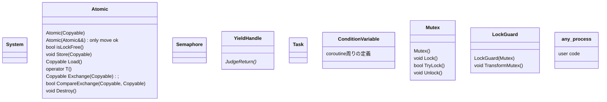

# systemの設計

**title: System Design**

```mermaid
classDiagram

    class System {
        
    }

    class Atomic {
        Atomic(Copyable)
        Atomic(Atomic&&) only move ok
        bool isLockFree()
        void Store(Copyable)
        Copyable Load()
        operator T()
        Copyable Exchange(Copyable);
        bool CompareExchange(Copyable, Copyable)
        void Destroy()

    }

    class Semaphore {
        
    }

    class YieldHandle {
        JudgeReturn()*
    }

    class Task {

    }

    class ConditionVariable {
        coroutine周りの定義
    }

    class Mutex {
        Mutex()
        void Lock()
        bool TryLock()
        void Unlock()
    }

    class LockGuard {
        LockGuard(Mutex)
        void TransformMutex()
    }

    class any_process {
        user code
    }

```